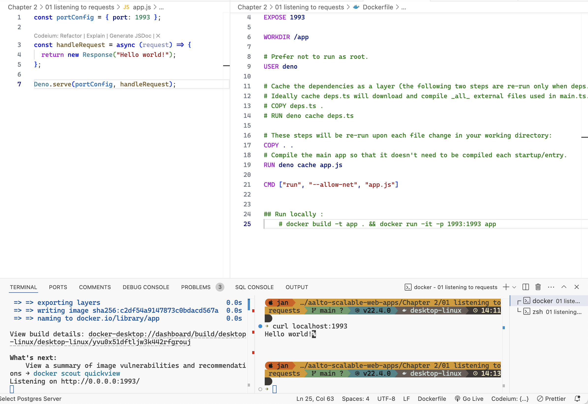

# Simple Deno Server

## Overview

This solution listens to requests to port 1993 and responds to requests with the message Hello world! It is implemented using the Deno.serve function which takes (1) options (e.g. the port) and (2) a function used to handle incoming requests.

## Screenshot

