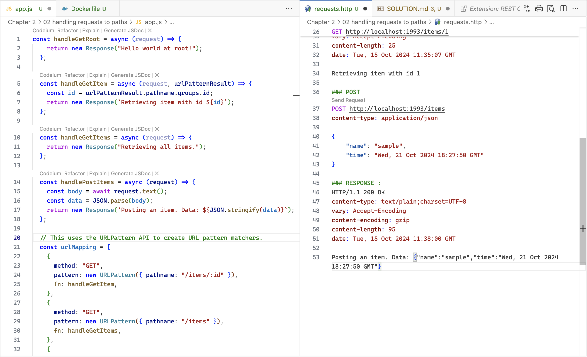

# Deno Server Responding to Different Paths

## Overview

The solution is a web server that handles requests to different paths. 

The [URL Pattern API](https://developer.mozilla.org/en-US/docs/Web/API/URL_Pattern_API) defines a syntax that is used to create URL pattern matchers. These patterns can be matched against URLs or individual URL components. The URL Pattern API is used by the URLPattern interface.

## Screenshot

